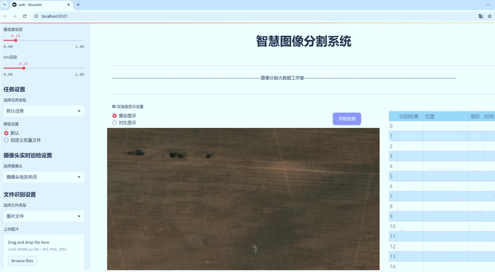
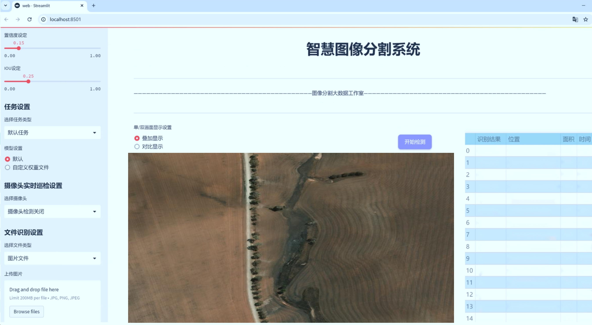
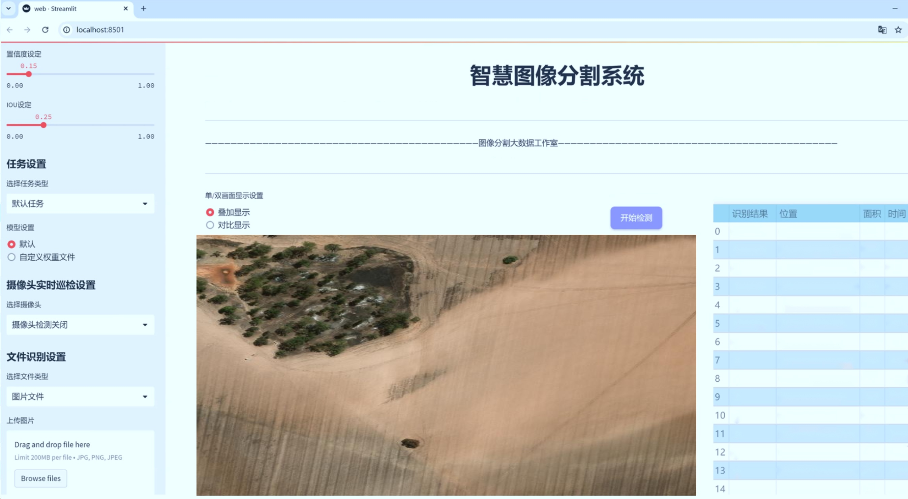
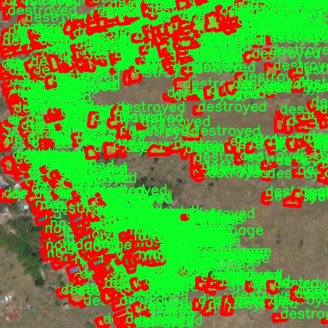
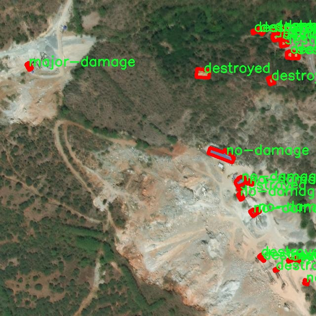
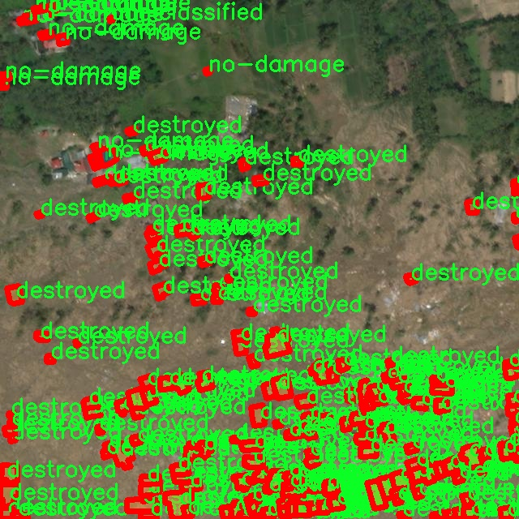
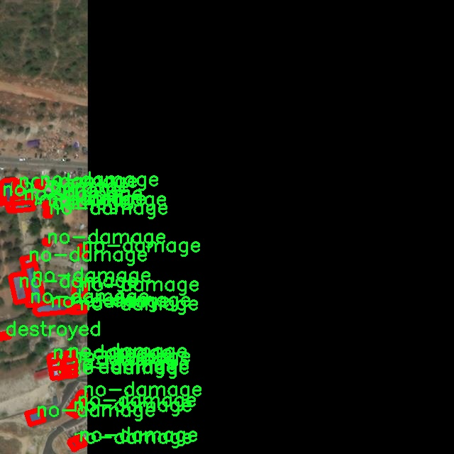
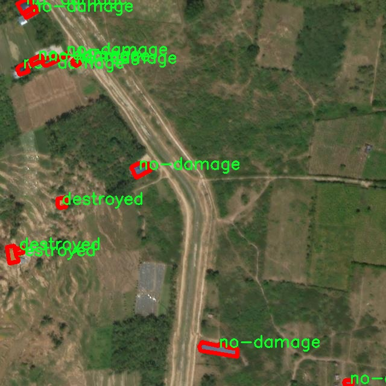

# 航拍建筑损伤完好识别图像分割系统： yolov8-seg-fasternet-bifpn

### 1.研究背景与意义

[参考博客](https://gitee.com/YOLOv8_YOLOv11_Segmentation_Studio/projects)

[博客来源](https://kdocs.cn/l/cszuIiCKVNis)

研究背景与意义

随着城市化进程的加快，建筑物的数量与复杂性日益增加，建筑损伤的监测与评估成为了保障公共安全与维护城市基础设施的重要任务。传统的建筑损伤检测方法多依赖人工巡检，不仅耗时耗力，而且容易受到主观因素的影响，导致检测结果的准确性和一致性难以保证。近年来，随着无人机技术的迅速发展，航拍技术逐渐成为建筑损伤检测的新兴手段。无人机搭载高分辨率摄像头，可以在短时间内获取大范围、高质量的建筑图像，为后续的损伤识别提供了丰富的数据基础。

在图像处理领域，深度学习技术的飞速发展为图像分割和目标检测提供了强有力的工具。YOLO（You Only Look Once）系列模型因其高效的实时检测能力而受到广泛关注。YOLOv8作为该系列的最新版本，结合了多种先进的网络结构与算法，具备了更强的特征提取能力和更高的检测精度。然而，现有的YOLOv8模型在处理特定领域的应用时，仍然面临着诸如类别不平衡、背景复杂等挑战。因此，基于改进YOLOv8的航拍建筑损伤完好识别图像分割系统的研究具有重要的理论和实践意义。

本研究所使用的数据集“damage2”包含6200幅图像，涵盖了五个类别：destroyed（毁坏）、major-damage（重大损伤）、minor-damage（轻微损伤）、no-damage（无损伤）和un-classified（未分类）。这一数据集的多样性和丰富性为模型的训练与评估提供了良好的基础。通过对这些图像进行实例分割，不仅可以精确识别出建筑物的损伤程度，还能为后续的修复和维护提供数据支持。此外，针对不同损伤类别的特征提取与分类，将有助于提高模型的准确性和鲁棒性，从而推动建筑损伤检测技术的进步。

在实际应用中，基于改进YOLOv8的图像分割系统能够实现对航拍图像的自动分析与处理，极大地提高了建筑损伤检测的效率与准确性。通过将深度学习与无人机航拍技术相结合，该系统不仅能够快速识别建筑物的损伤情况，还能为相关部门提供实时的数据支持，帮助决策者及时采取相应的维护措施。这一研究不仅具有重要的学术价值，也为城市管理与基础设施维护提供了切实可行的解决方案。

综上所述，基于改进YOLOv8的航拍建筑损伤完好识别图像分割系统的研究，不仅填补了现有技术在特定应用领域的空白，也为未来智能城市建设与管理提供了新的思路与方法。通过对建筑损伤的精准识别与分类，该系统将为提高城市基础设施的安全性与可靠性做出积极贡献，具有广泛的应用前景与社会价值。

### 2.图片演示







注意：本项目提供完整的训练源码数据集和训练教程,由于此博客编辑较早,暂不提供权重文件（best.pt）,需要按照6.训练教程进行训练后实现上图效果。

### 3.视频演示

[3.1 视频演示](https://www.bilibili.com/video/BV1pSBWY3Eif/)

### 4.数据集信息

##### 4.1 数据集类别数＆类别名

nc: 5
names: ['destroyed', 'major-damage', 'minor-damage', 'no-damage', 'un-classified']


##### 4.2 数据集信息简介

数据集信息展示

在现代建筑监测与维护领域，航拍技术的应用日益广泛，尤其是在建筑损伤识别与评估方面。为此，构建一个高效且准确的图像分割系统显得尤为重要。本研究所采用的数据集“damage2”正是为此目的而精心设计，旨在训练和改进YOLOv8-seg模型，以实现对航拍建筑损伤的精确识别与分类。

“damage2”数据集包含五个主要类别，分别为“destroyed”（完全损坏）、“major-damage”（重大损坏）、“minor-damage”（轻微损坏）、“no-damage”（无损伤）以及“un-classified”（未分类）。这些类别的设定不仅涵盖了建筑物在不同损伤程度下的状态，还考虑到了可能存在的分类不确定性，提供了更为全面的损伤评估框架。

在数据集的构建过程中，研究团队从多个不同的航拍场景中收集了大量图像，确保数据的多样性和代表性。这些图像来源于城市建筑、乡村房屋、桥梁、隧道等多种建筑类型，涵盖了不同的地理环境和气候条件。这种多样性使得模型在训练过程中能够学习到更丰富的特征，从而提高其在实际应用中的泛化能力。

每个类别的图像都经过精细的标注，确保模型能够准确识别出建筑物的损伤状态。标注工作不仅包括对损伤区域的分割，还涉及到对损伤程度的细致分类。通过这种方式，数据集为模型提供了高质量的训练样本，使其能够在面对复杂场景时，依然保持较高的识别精度。

此外，数据集“damage2”还特别考虑到了数据的平衡性。在构建过程中，研究团队确保每个类别的样本数量相对均衡，以避免模型在训练时出现偏向某一类别的现象。这种平衡性对于提升模型的整体性能至关重要，尤其是在处理具有高度不确定性的建筑损伤识别任务时。

为了进一步提升模型的鲁棒性，数据集还引入了数据增强技术。通过对原始图像进行旋转、缩放、裁剪、亮度调整等多种变换，研究团队有效地扩展了数据集的规模。这不仅增加了模型的训练样本数量，还帮助模型学习到更多的特征变换，从而提高其在不同环境下的适应能力。

总之，数据集“damage2”为航拍建筑损伤识别提供了一个坚实的基础。通过精心设计的类别划分、丰富的图像样本以及高质量的标注，研究团队为YOLOv8-seg模型的训练提供了充足的支持。这一数据集的成功构建，将为未来建筑损伤监测技术的发展奠定重要基础，推动智能建筑维护的进程，提升建筑安全管理的效率与准确性。











### 5.项目依赖环境部署教程（零基础手把手教学）

[5.1 环境部署教程链接（零基础手把手教学）](https://www.bilibili.com/video/BV1jG4Ve4E9t/?vd_source=bc9aec86d164b67a7004b996143742dc)


[5.2 安装Python虚拟环境创建和依赖库安装视频教程链接（零基础手把手教学）](https://www.bilibili.com/video/BV1nA4VeYEze/?vd_source=bc9aec86d164b67a7004b996143742dc)

### 6.手把手YOLOV8-seg训练视频教程（零基础手把手教学）

[6.1 手把手YOLOV8-seg训练视频教程（零基础小白有手就能学会）](https://www.bilibili.com/video/BV1cA4VeYETe/?vd_source=bc9aec86d164b67a7004b996143742dc)


按照上面的训练视频教程链接加载项目提供的数据集，运行train.py即可开始训练



     Epoch   gpu_mem       box       obj       cls    labels  img_size
     1/200     0G   0.01576   0.01955  0.007536        22      1280: 100%|██████████| 849/849 [14:42<00:00,  1.04s/it]
               Class     Images     Labels          P          R     mAP@.5 mAP@.5:.95: 100%|██████████| 213/213 [01:14<00:00,  2.87it/s]
                 all       3395      17314      0.994      0.957      0.0957      0.0843

     Epoch   gpu_mem       box       obj       cls    labels  img_size
     2/200     0G   0.01578   0.01923  0.007006        22      1280: 100%|██████████| 849/849 [14:44<00:00,  1.04s/it]
               Class     Images     Labels          P          R     mAP@.5 mAP@.5:.95: 100%|██████████| 213/213 [01:12<00:00,  2.95it/s]
                 all       3395      17314      0.996      0.956      0.0957      0.0845

     Epoch   gpu_mem       box       obj       cls    labels  img_size
     3/200     0G   0.01561    0.0191  0.006895        27      1280: 100%|██████████| 849/849 [10:56<00:00,  1.29it/s]
               Class     Images     Labels          P          R     mAP@.5 mAP@.5:.95: 100%|███████   | 187/213 [00:52<00:00,  4.04it/s]
                 all       3395      17314      0.996      0.957      0.0957      0.0845


### 7.50+种全套YOLOV8-seg创新点加载调参实验视频教程（一键加载写好的改进模型的配置文件）

[7.1 50+种全套YOLOV8-seg创新点加载调参实验视频教程（一键加载写好的改进模型的配置文件）](https://www.bilibili.com/video/BV1Hw4VePEXv/?vd_source=bc9aec86d164b67a7004b996143742dc)

### YOLOV8-seg算法简介

原始YOLOv8-seg算法原理

YOLOv8-seg算法是YOLO系列中的最新版本，旨在结合目标检测与图像分割的任务，以实现更为精细的视觉理解。该算法的设计基于YOLOv8的基础架构，充分利用了其在检测精度和速度上的优势，同时引入了分割的能力，使得模型不仅能够识别目标，还能对目标进行像素级的分割。这一创新使得YOLOv8-seg在处理复杂场景时，尤其是在需要高精度分割的应用中，展现出更为出色的性能。

YOLOv8-seg的整体结构依然遵循YOLO系列的单阶段检测理念，主要由输入模块、Backbone骨干网络、Neck特征融合网络和Head检测模块四个部分组成。输入模块负责对输入图像进行预处理，包括图像的缩放、Mosaic增强以及瞄点计算等，以确保模型能够接收到适合的输入数据。此阶段的预处理不仅提升了数据的多样性，还增强了模型的鲁棒性，使其在不同环境下都能保持较高的性能。

在Backbone部分，YOLOv8-seg延续了YOLOv8的设计思路，采用了DarkNet结构，但在特征提取过程中引入了C2f模块，以替代传统的C3模块。这一改进的核心在于其对梯度流动的优化，能够更有效地保留特征信息，尤其是在处理复杂背景和小目标时，C2f模块的优势愈加明显。SPPF模块的引入进一步增强了特征图的处理能力，通过不同内核尺寸的池化操作，YOLOv8-seg能够有效地合并特征，提升了特征图的表达能力，为后续的特征融合奠定了基础。

Neck部分采用了双塔结构，结合了特征金字塔网络和路径聚合网络。这一设计不仅促进了语义特征与定位特征的有效转移，还增强了网络对不同尺度目标的检测能力。通过这种特征融合机制，YOLOv8-seg能够在处理多尺度目标时，保持高精度的检测效果，尤其是在复杂场景下的小目标检测上，展现出其独特的优势。

在Head检测模块中，YOLOv8-seg采用了解耦头的结构，分离了回归分支和预测分支。这一设计的优点在于加速了模型的收敛过程，同时也提高了检测的精度。通过解耦的方式，模型能够更灵活地处理分类和回归任务，使得目标检测与分割的过程更加高效。YOLOv8-seg在损失计算方面也进行了优化，采用了更为先进的损失函数，以提高模型的泛化能力和精确度。

YOLOv8-seg在目标检测的基础上，增加了图像分割的能力，使得模型不仅能够识别出目标的边界，还能对目标进行像素级的分类。这一特性在许多实际应用中具有重要意义，例如在自动驾驶、医学影像分析和智能监控等领域，能够提供更为细致的视觉信息，帮助系统做出更为准确的决策。

尽管YOLOv8-seg在设计上做出了诸多优化，但在复杂环境下，尤其是水面等背景复杂的场景中，仍然面临着一些挑战。小目标的漂浮物特征复杂且背景多样，导致模型在定位和感知能力上存在一定的不足。为了解决这些问题，YOLOv8-seg引入了多种技术手段。例如，通过引入BiFormer双层路由注意力机制，增强了模型对远程依赖的捕获能力，进而保留了特征提取过程中的细粒度上下文信息。此外，针对小目标的漏检问题，YOLOv8-seg还添加了更小的检测头，以提升网络对小目标的感知能力。

在算法的损失函数设计上，YOLOv8-seg使用了MPDIoU损失函数替代传统的CIoU损失函数，以提高模型的泛化能力和精准度。这一改进使得模型在训练过程中能够更好地适应复杂的场景，提高了检测和分割的整体性能。

综上所述，YOLOv8-seg算法通过对YOLOv8的结构和功能进行优化，成功地将目标检测与图像分割相结合，展现出强大的性能。其在特征提取、特征融合和损失计算等多个方面的创新，使得YOLOv8-seg在处理复杂场景时，能够提供更为精确和全面的视觉理解。这一算法的成功应用，将为智能监控、自动驾驶等领域带来新的机遇，推动相关技术的进一步发展。


### 9.系统功能展示（检测对象为举例，实际内容以本项目数据集为准）

图9.1.系统支持检测结果表格显示

  图9.2.系统支持置信度和IOU阈值手动调节

  图9.3.系统支持自定义加载权重文件best.pt(需要你通过步骤5中训练获得)

  图9.4.系统支持摄像头实时识别

  图9.5.系统支持图片识别

  图9.6.系统支持视频识别

  图9.7.系统支持识别结果文件自动保存

  图9.8.系统支持Excel导出检测结果数据


### 10.50+种全套YOLOV8-seg创新点原理讲解（非科班也可以轻松写刊发刊，V11版本正在科研待更新）

#### 10.1 由于篇幅限制，每个创新点的具体原理讲解就不一一展开，具体见下列网址中的创新点对应子项目的技术原理博客网址【Blog】：


[10.1 50+种全套YOLOV8-seg创新点原理讲解链接](https://gitee.com/qunmasj/good)

#### 10.2 部分改进模块原理讲解(完整的改进原理见上图和技术博客链接)【如果此小节的图加载失败可以通过CSDN或者Github搜索该博客的标题访问原始博客，原始博客图片显示正常】
### CBAM空间注意力机制
近年来，随着深度学习研究方向的火热，注意力机制也被广泛地应用在图像识别、语音识别和自然语言处理等领域，注意力机制在深度学习任务中发挥着举足轻重的作用。注意力机制借鉴于人类的视觉系统，例如，人眼在看到一幅画面时，会倾向于关注画面中的重要信息，而忽略其他可见的信息。深度学习中的注意力机制和人类视觉的注意力机制相似，通过扫描全局数据，从大量数据中选择出需要重点关注的、对当前任务更为重要的信息，然后对这部分信息分配更多的注意力资源，从这些信息中获取更多所需要的细节信息，而抑制其他无用的信息。而在深度学习中，则具体表现为给感兴趣的区域更高的权重，经过网络的学习和调整，得到最优的权重分配，形成网络模型的注意力，使网络拥有更强的学习能力，加快网络的收敛速度。
注意力机制通常可分为软注意力机制和硬注意力机制[4-5]。软注意力机制在选择信息时，不是从输入的信息中只选择1个，而会用到所有输入信息，只是各个信息对应的权重分配不同，然后输入网络模型进行计算;硬注意力机制则是从输入的信息中随机选取一个或者选择概率最高的信息，但是这一步骤通常是不可微的，导致硬注意力机制更难训练。因此，软注意力机制应用更为广泛，按照原理可将软注意力机制划分为:通道注意力机制（channel attention)、空间注意力机制(spatial attention）和混合域注意力机制(mixed attention)。
通道注意力机制的本质建立各个特征通道之间的重要程度，对感兴趣的通道进行重点关注，弱化不感兴趣的通道的作用;空间注意力的本质则是建模了整个空间信息的重要程度，然后对空间内感兴趣的区域进行重点关注，弱化其余非感兴趣区域的作用;混合注意力同时运用了通道注意力和空间注意力，两部分先后进行或并行，形成对通道特征和空间特征同时关注的注意力模型。

卷积层注意力模块(Convolutional Block Attention Module，CBAM）是比较常用的混合注意力模块，其先后集中了通道注意力模块和空间注意力模块，网络中加入该模块能有效提高网络性能，减少网络模型的计算量，模块结构如图所示。输入特征图首先经过分支的通道注意力模块，然后和主干的原特征图融合，得到具有通道注意力的特征图，接着经过分支的空间注意力模块，在和主干的特征图融合后，得到同时具有通道特征注意力和空间特征注意力的特征图。CBAM模块不改变输入特征图的大小，因此该模块是一个“即插即用”的模块，可以插入网络的任何位置。

通道注意力模块的结构示意图如图所示，通道注意力模块分支并行地对输入的特征图进行最大池化操作和平均池化操作，然后利用多层感知机对结果进行变换，得到应用于两个通道的变换结果，最后经过sigmoid激活函数将变换结果融合，得到具有通道注意力的通道特征图。

空间注意力模块示意图如图所示，将通道注意力模块输出的特征图作为该模块的输入特征图，首先对输入特征图进行基于通道的最大池化操作和平均池化操作，将两部分得到的结果拼接起来，然后通过卷积得到降为Ⅰ通道的特征图，最后通过sigmoid激活函数生成具有空间注意力的特征图。


### 11.项目核心源码讲解（再也不用担心看不懂代码逻辑）

#### 11.1 train.py

以下是代码的核心部分，并附上详细的中文注释：

```python
import os
import torch
import yaml
from ultralytics import YOLO  # 导入YOLO模型库

if __name__ == '__main__':  # 确保该模块被直接运行时才执行以下代码
    # 设置训练参数
    workers = 1  # 数据加载的工作进程数
    batch = 8  # 每个批次的样本数量
    device = "0" if torch.cuda.is_available() else "cpu"  # 检查是否有可用的GPU，如果没有则使用CPU

    # 获取数据集的YAML配置文件的绝对路径
    data_path = abs_path(f'datasets/data/data.yaml', path_type='current')

    # 将路径转换为Unix风格
    unix_style_path = data_path.replace(os.sep, '/')
    # 获取目录路径
    directory_path = os.path.dirname(unix_style_path)

    # 读取YAML文件，保持原有顺序
    with open(data_path, 'r') as file:
        data = yaml.load(file, Loader=yaml.FullLoader)

    # 修改YAML文件中的路径项
    if 'train' in data and 'val' in data and 'test' in data:
        data['train'] = directory_path + '/train'  # 更新训练集路径
        data['val'] = directory_path + '/val'      # 更新验证集路径
        data['test'] = directory_path + '/test'    # 更新测试集路径

        # 将修改后的数据写回YAML文件
        with open(data_path, 'w') as file:
            yaml.safe_dump(data, file, sort_keys=False)

    # 加载YOLO模型配置和预训练权重
    model = YOLO(r"C:\codeseg\codenew\50+种YOLOv8算法改进源码大全和调试加载训练教程（非必要）\改进YOLOv8模型配置文件\yolov8-seg-C2f-Faster.yaml").load("./weights/yolov8s-seg.pt")

    # 开始训练模型
    results = model.train(
        data=data_path,  # 指定训练数据的配置文件路径
        device=device,  # 指定训练设备（GPU或CPU）
        workers=workers,  # 指定使用的工作进程数
        imgsz=640,  # 指定输入图像的大小为640x640
        epochs=100,  # 指定训练的轮数为100
        batch=batch,  # 指定每个批次的大小为8
    )
```

### 代码分析：
1. **导入必要的库**：代码开始时导入了必要的库，包括`os`、`torch`、`yaml`和`YOLO`模型。
2. **主程序入口**：使用`if __name__ == '__main__':`确保只有在直接运行该脚本时才会执行后续代码。
3. **设置训练参数**：定义了数据加载的工作进程数、批次大小和设备（GPU或CPU）。
4. **读取和修改YAML配置文件**：加载数据集的配置文件，更新训练、验证和测试集的路径，并将修改后的内容写回文件。
5. **加载YOLO模型**：根据指定的配置文件和预训练权重加载YOLO模型。
6. **训练模型**：调用`model.train()`方法开始训练，传入必要的参数，如数据路径、设备、工作进程数、图像大小、训练轮数和批次大小。

### 注意事项：
- 在实际使用中，需要根据具体的硬件条件调整`batch`和`workers`的值，以避免显存不足的问题。
- 确保提供的路径和文件存在，以避免文件读取错误。

该程序文件`train.py`的主要功能是使用YOLO（You Only Look Once）模型进行目标检测的训练。程序首先导入了一些必要的库，包括`os`、`torch`、`yaml`和`matplotlib`，其中`YOLO`是从`ultralytics`库中导入的，用于加载和训练YOLO模型。

在`__main__`块中，程序首先设置了一些训练参数，包括工作进程数`workers`、批次大小`batch`、以及设备`device`。`device`的设置根据当前是否有可用的GPU（CUDA）来决定，如果有则使用GPU，否则使用CPU。接着，程序通过`abs_path`函数获取数据集配置文件`data.yaml`的绝对路径，并将其路径格式转换为Unix风格。

随后，程序读取YAML文件，解析其中的数据，并检查是否包含`train`、`val`和`test`的路径。如果存在这些路径，程序会将其修改为绝对路径，并将修改后的数据重新写回到YAML文件中。这一步是为了确保训练、验证和测试数据的路径是正确的，以便后续的训练过程能够顺利进行。

接下来，程序加载YOLO模型的配置文件和预训练权重。这里的模型配置文件是`yolov8-seg-C2f-Faster.yaml`，而权重文件是`yolov8s-seg.pt`。用户可以根据自己的需求选择不同的模型配置文件。

最后，程序调用`model.train()`方法开始训练模型。在训练过程中，指定了训练数据的配置文件路径、设备、工作进程数、输入图像的大小（640x640）、以及训练的轮数（100个epoch）和每个批次的大小（8）。这些参数的设置会影响训练的效率和效果。

总体来说，该程序实现了YOLO模型的训练过程，涵盖了数据路径的设置、模型的加载以及训练参数的配置等关键步骤。

#### 11.2 ultralytics\utils\files.py

以下是代码中最核心的部分，并附上详细的中文注释：

```python
import os
from pathlib import Path
from contextlib import contextmanager

@contextmanager
def spaces_in_path(path):
    """
    处理路径中包含空格的上下文管理器。如果路径包含空格，则将其替换为下划线，
    复制文件/目录到新路径，执行上下文代码块，然后将文件/目录复制回原位置。

    参数:
        path (str | Path): 原始路径。

    返回:
        (Path): 如果路径中存在空格，则返回替换下划线的临时路径，否则返回原始路径。
    """
    # 如果路径中有空格，则将其替换为下划线
    if ' ' in str(path):
        path = Path(path)  # 将路径转换为Path对象

        # 创建一个临时目录并构造新的路径
        with tempfile.TemporaryDirectory() as tmp_dir:
            tmp_path = Path(tmp_dir) / path.name.replace(' ', '_')  # 替换空格后的新路径

            # 复制文件/目录
            if path.is_dir():
                shutil.copytree(path, tmp_path)  # 复制目录
            elif path.is_file():
                shutil.copy2(path, tmp_path)  # 复制文件

            try:
                # 返回临时路径
                yield tmp_path
            finally:
                # 将文件/目录复制回原位置
                if tmp_path.is_dir():
                    shutil.copytree(tmp_path, path, dirs_exist_ok=True)
                elif tmp_path.is_file():
                    shutil.copy2(tmp_path, path)  # 复制回文件

    else:
        # 如果没有空格，直接返回原始路径
        yield path


def increment_path(path, exist_ok=False, sep='', mkdir=False):
    """
    增加文件或目录路径，即将路径后面添加一个数字，例如 runs/exp --> runs/exp{sep}2, runs/exp{sep}3 等。

    如果路径存在且exist_ok未设置为True，则路径将通过在路径末尾附加数字和分隔符进行递增。
    如果路径是文件，则保留文件扩展名；如果路径是目录，则数字将直接附加到路径末尾。
    如果mkdir设置为True，则如果路径不存在，将创建该路径作为目录。

    参数:
        path (str, pathlib.Path): 要递增的路径。
        exist_ok (bool, optional): 如果为True，则路径不会递增，原样返回。默认为False。
        sep (str, optional): 路径和递增数字之间使用的分隔符。默认为''。
        mkdir (bool, optional): 如果路径不存在，则创建目录。默认为False。

    返回:
        (pathlib.Path): 递增后的路径。
    """
    path = Path(path)  # 处理路径
    if path.exists() and not exist_ok:
        path, suffix = (path.with_suffix(''), path.suffix) if path.is_file() else (path, '')

        # 递增路径
        for n in range(2, 9999):
            p = f'{path}{sep}{n}{suffix}'  # 生成递增路径
            if not os.path.exists(p):  # 检查路径是否存在
                break
        path = Path(p)

    if mkdir:
        path.mkdir(parents=True, exist_ok=True)  # 创建目录

    return path
```

### 代码核心部分解释：
1. **`spaces_in_path` 函数**：
   - 这是一个上下文管理器，用于处理路径中包含空格的情况。它会在路径中存在空格时，将空格替换为下划线，并在临时路径中执行代码块，最后将文件或目录复制回原始位置。

2. **`increment_path` 函数**：
   - 该函数用于递增文件或目录的路径。它会检查路径是否存在，如果存在，则在路径后添加一个数字，以确保生成的新路径是唯一的。可以选择创建目录或保留原路径。

这两个函数在文件和目录管理中非常实用，尤其是在处理文件路径和确保路径唯一性时。

这个程序文件是Ultralytics YOLO项目中的一个工具模块，主要用于处理文件和目录的操作。代码中定义了一些类和函数，具体功能如下：

首先，`WorkingDirectory`类是一个上下文管理器，允许用户在指定的工作目录中执行代码。通过使用`@WorkingDirectory(dir)`装饰器或`with WorkingDirectory(dir):`语句，用户可以在指定目录中运行代码，完成后会自动恢复到原来的工作目录。这个类在初始化时接收一个新的目录路径，并在进入上下文时更改当前工作目录，在退出时恢复原来的目录。

接下来，`spaces_in_path`是另一个上下文管理器，用于处理路径中包含空格的情况。如果路径中有空格，它会将空格替换为下划线，并将文件或目录复制到一个临时路径中执行代码块。执行完后，它会将文件或目录复制回原来的位置。这对于某些文件系统或命令行工具在处理路径时可能会遇到的问题非常有用。

`increment_path`函数用于递增文件或目录的路径。如果指定的路径已经存在，并且`exist_ok`参数为`False`，则会在路径后面添加一个数字后缀（例如，将`runs/exp`变为`runs/exp2`）。该函数还支持创建目录的选项，如果`mkdir`参数为`True`，则会在路径不存在时创建该目录。

`file_age`函数返回文件自上次更新以来的天数，`file_date`函数返回文件的最后修改日期，格式为'YYYY-MM-DD'。这两个函数通过获取文件的最后修改时间来实现。

`file_size`函数返回指定文件或目录的大小（以MB为单位）。如果是文件，它直接返回文件的大小；如果是目录，它会递归计算目录中所有文件的总大小。

最后，`get_latest_run`函数用于查找指定目录下最新的`last.pt`文件，通常用于恢复训练的模型。它会在给定的搜索目录中查找所有匹配的文件，并返回最新的一个。

总体来说，这个文件提供了一些实用的工具函数和上下文管理器，方便用户在处理文件和目录时进行各种操作，尤其是在机器学习和深度学习的训练过程中。

#### 11.3 ultralytics\models\nas\predict.py

以下是代码中最核心的部分，并附上详细的中文注释：

```python
import torch
from ultralytics.engine.predictor import BasePredictor
from ultralytics.engine.results import Results
from ultralytics.utils import ops

class NASPredictor(BasePredictor):
    """
    Ultralytics YOLO NAS 预测器，用于目标检测。

    该类扩展了 Ultralytics 引擎中的 `BasePredictor`，负责对 YOLO NAS 模型生成的原始预测结果进行后处理。
    它应用了非极大值抑制（NMS）和将边界框缩放到原始图像尺寸等操作。

    属性:
        args (Namespace): 包含各种后处理配置的命名空间。
    """

    def postprocess(self, preds_in, img, orig_imgs):
        """对预测结果进行后处理，并返回结果对象的列表。"""

        # 将预测框转换为xywh格式（左上角和宽高）
        boxes = ops.xyxy2xywh(preds_in[0][0])
        # 将边界框和类分数合并，并调整维度
        preds = torch.cat((boxes, preds_in[0][1]), -1).permute(0, 2, 1)

        # 应用非极大值抑制，过滤掉重叠的边界框
        preds = ops.non_max_suppression(preds,
                                        self.args.conf,  # 置信度阈值
                                        self.args.iou,   # IOU阈值
                                        agnostic=self.args.agnostic_nms,  # 是否类别无关的NMS
                                        max_det=self.args.max_det,  # 最大检测数量
                                        classes=self.args.classes)  # 过滤特定类别

        # 如果输入图像不是列表，则将其转换为numpy数组
        if not isinstance(orig_imgs, list):  
            orig_imgs = ops.convert_torch2numpy_batch(orig_imgs)

        results = []  # 存储结果的列表
        for i, pred in enumerate(preds):
            orig_img = orig_imgs[i]  # 获取原始图像
            # 将边界框缩放到原始图像的尺寸
            pred[:, :4] = ops.scale_boxes(img.shape[2:], pred[:, :4], orig_img.shape)
            img_path = self.batch[0][i]  # 获取图像路径
            # 创建结果对象并添加到结果列表中
            results.append(Results(orig_img, path=img_path, names=self.model.names, boxes=pred))
        
        return results  # 返回后处理的结果列表
```

### 代码核心部分说明：
1. **导入必要的库**：导入了 PyTorch 和 Ultralytics 中的相关模块。
2. **NASPredictor 类**：继承自 `BasePredictor`，负责 YOLO NAS 模型的后处理。
3. **postprocess 方法**：该方法对模型的原始预测结果进行后处理，主要步骤包括：
   - 将预测框从 `xyxy` 格式转换为 `xywh` 格式。
   - 合并边界框和类分数，并调整维度。
   - 应用非极大值抑制（NMS）来去除重叠的边界框。
   - 将边界框缩放到原始图像的尺寸。
   - 将处理后的结果存储在 `Results` 对象中并返回。

这个程序文件是Ultralytics YOLO（You Only Look Once）模型中的一个预测模块，专门用于处理YOLO NAS（Neural Architecture Search）模型的预测结果。它继承自`BasePredictor`类，主要负责对YOLO NAS模型生成的原始预测结果进行后处理。

在这个类中，`postprocess`方法是核心功能，它接受三个参数：`preds_in`（原始预测结果）、`img`（输入图像）和`orig_imgs`（原始图像）。该方法的主要任务是将原始预测结果转换为可用的格式，并进行必要的后处理操作。

首先，方法使用`ops.xyxy2xywh`将预测框的坐标从xyxy格式转换为xywh格式，然后将预测框和对应的类别分数进行拼接。接着，调用`ops.non_max_suppression`函数对预测结果进行非极大值抑制，以去除重叠的框，只保留最有可能的框。这个过程涉及到一些参数，如置信度阈值、IOU阈值、是否使用类无关的NMS、最大检测数量以及需要检测的类别。

接下来，方法检查输入的原始图像是否为列表格式，如果不是，则将其转换为NumPy数组。然后，针对每个预测结果，方法会将预测框的坐标缩放到原始图像的尺寸，并将结果封装成`Results`对象。最后，返回一个包含所有结果的列表。

这个类通常不会被直接实例化，而是在`NAS`类内部使用。通过这个模块，用户可以方便地对YOLO NAS模型的预测结果进行后处理，从而得到最终的检测结果。

#### 11.4 ultralytics\trackers\byte_tracker.py

以下是代码中最核心的部分，并附上详细的中文注释：

```python
import numpy as np
from .basetrack import BaseTrack, TrackState
from .utils import matching
from .utils.kalman_filter import KalmanFilterXYAH

class STrack(BaseTrack):
    """
    单目标跟踪表示，使用卡尔曼滤波进行状态估计。

    该类负责存储与单个跟踪相关的所有信息，并基于卡尔曼滤波进行状态更新和预测。
    """

    shared_kalman = KalmanFilterXYAH()  # 共享的卡尔曼滤波器实例

    def __init__(self, tlwh, score, cls):
        """初始化新的STrack实例。"""
        # 将输入的边界框转换为tlwh格式并存储
        self._tlwh = np.asarray(self.tlbr_to_tlwh(tlwh[:-1]), dtype=np.float32)
        self.kalman_filter = None  # 初始化卡尔曼滤波器
        self.mean, self.covariance = None, None  # 初始化均值和协方差
        self.is_activated = False  # 跟踪是否激活的标志

        self.score = score  # 跟踪的置信度分数
        self.tracklet_len = 0  # 跟踪片段的长度
        self.cls = cls  # 目标的类别标签
        self.idx = tlwh[-1]  # 目标的索引

    def predict(self):
        """使用卡尔曼滤波器预测目标的下一个状态。"""
        mean_state = self.mean.copy()  # 复制当前均值状态
        if self.state != TrackState.Tracked:  # 如果状态不是被跟踪状态
            mean_state[7] = 0  # 将速度设为0
        # 进行预测并更新均值和协方差
        self.mean, self.covariance = self.kalman_filter.predict(mean_state, self.covariance)

    def activate(self, kalman_filter, frame_id):
        """激活新的跟踪片段。"""
        self.kalman_filter = kalman_filter  # 设置卡尔曼滤波器
        self.track_id = self.next_id()  # 获取下一个跟踪ID
        # 初始化均值和协方差
        self.mean, self.covariance = self.kalman_filter.initiate(self.convert_coords(self._tlwh))

        self.tracklet_len = 0  # 重置跟踪片段长度
        self.state = TrackState.Tracked  # 设置状态为被跟踪
        if frame_id == 1:
            self.is_activated = True  # 如果是第一帧，则激活
        self.frame_id = frame_id  # 设置当前帧ID
        self.start_frame = frame_id  # 设置开始帧

    def update(self, new_track, frame_id):
        """
        更新匹配的跟踪状态。

        参数:
            new_track (STrack): 包含更新信息的新跟踪。
            frame_id (int): 当前帧的ID。
        """
        self.frame_id = frame_id  # 更新当前帧ID
        self.tracklet_len += 1  # 增加跟踪片段长度

        new_tlwh = new_track.tlwh  # 获取新的边界框
        # 使用卡尔曼滤波器更新均值和协方差
        self.mean, self.covariance = self.kalman_filter.update(self.mean, self.covariance,
                                                               self.convert_coords(new_tlwh))
        self.state = TrackState.Tracked  # 设置状态为被跟踪
        self.is_activated = True  # 激活跟踪

        self.score = new_track.score  # 更新置信度分数
        self.cls = new_track.cls  # 更新类别标签
        self.idx = new_track.idx  # 更新索引

    @property
    def tlwh(self):
        """获取当前边界框位置（左上角x, 左上角y, 宽度, 高度）。"""
        if self.mean is None:
            return self._tlwh.copy()  # 如果均值为None，返回初始值
        ret = self.mean[:4].copy()  # 复制均值的前四个元素
        ret[2] *= ret[3]  # 宽度 = 宽度 * 高度
        ret[:2] -= ret[2:] / 2  # 左上角坐标减去宽度和高度的一半
        return ret

    @staticmethod
    def tlwh_to_xyah(tlwh):
        """将边界框转换为格式（中心x, 中心y, 纵横比, 高度）。"""
        ret = np.asarray(tlwh).copy()  # 复制输入的tlwh
        ret[:2] += ret[2:] / 2  # 计算中心坐标
        ret[2] /= ret[3]  # 计算纵横比
        return ret
```

### 代码核心部分说明：
1. **STrack类**：用于表示单个目标的跟踪，使用卡尔曼滤波进行状态估计和更新。
2. **属性**：
   - `shared_kalman`：所有STrack实例共享的卡尔曼滤波器。
   - `_tlwh`：存储边界框的左上角坐标、宽度和高度。
   - `mean`和`covariance`：用于存储目标状态的均值和协方差。
   - `is_activated`：标志跟踪是否被激活。
   - `score`、`tracklet_len`、`cls`、`idx`等：存储目标的置信度、跟踪片段长度、类别和索引等信息。
3. **方法**：
   - `predict()`：使用卡尔曼滤波器预测目标的下一个状态。
   - `activate()`：激活新的跟踪片段并初始化状态。
   - `update()`：更新目标的状态，使用新的检测信息。
   - `tlwh`属性：返回当前目标的边界框信息。
   - `tlwh_to_xyah()`：将边界框从tlwh格式转换为xyah格式。

这些核心部分和方法是实现目标跟踪的基础，结合卡尔曼滤波器的预测和更新机制，能够有效地进行目标跟踪。

这个程序文件`ultralytics/trackers/byte_tracker.py`实现了一个基于YOLOv8的对象跟踪算法，主要用于视频序列中检测和跟踪对象。它定义了两个主要的类：`STrack`和`BYTETracker`，分别用于表示单个对象的跟踪状态和管理多个对象的跟踪。

`STrack`类是单个对象跟踪的表示，使用卡尔曼滤波器进行状态估计。它包含了多个属性，如共享的卡尔曼滤波器、边界框的坐标和尺寸、卡尔曼滤波器实例、状态均值和协方差、激活状态、置信度分数、跟踪长度、对象类别、索引、当前帧ID和首次检测的帧ID。该类提供了多种方法，包括预测下一个状态、激活新的跟踪、更新状态、坐标转换等。通过这些方法，`STrack`能够处理对象的跟踪状态更新和预测。

`BYTETracker`类则负责整体的跟踪管理。它维护了已跟踪、丢失和移除的跟踪列表，并使用卡尔曼滤波器预测新对象的位置。该类的构造函数初始化了一些属性，包括当前帧ID、命令行参数、最大丢失时间和卡尔曼滤波器实例。`update`方法是其核心功能，负责处理新的检测结果，更新跟踪状态，执行数据关联，并根据检测的置信度和IOU（交并比）进行匹配。该方法分为多个步骤，包括激活新的跟踪、更新已跟踪的对象、处理丢失的跟踪和移除不再跟踪的对象。

在跟踪过程中，`BYTETracker`还提供了一些辅助方法，例如计算跟踪和检测之间的距离、初始化跟踪、合并和过滤跟踪列表等。这些方法使得跟踪过程更加高效和准确。

总体而言，这个文件实现了一个完整的对象跟踪系统，结合了卡尔曼滤波和YOLOv8的检测能力，能够在视频序列中实时跟踪多个对象。

#### 11.5 ultralytics\nn\extra_modules\ops_dcnv3\functions\dcnv3_func.py

以下是经过简化并添加详细中文注释的核心代码部分：

```python
import torch
import torch.nn.functional as F
from torch.autograd import Function
from torch.cuda.amp import custom_bwd, custom_fwd

class DCNv3Function(Function):
    @staticmethod
    @custom_fwd
    def forward(ctx, input, offset, mask, kernel_h, kernel_w, stride_h, stride_w, pad_h, pad_w, dilation_h, dilation_w, group, group_channels, offset_scale, im2col_step, remove_center):
        # 保存前向传播所需的参数到上下文中
        ctx.kernel_h = kernel_h
        ctx.kernel_w = kernel_w
        ctx.stride_h = stride_h
        ctx.stride_w = stride_w
        ctx.pad_h = pad_h
        ctx.pad_w = pad_w
        ctx.dilation_h = dilation_h
        ctx.dilation_w = dilation_w
        ctx.group = group
        ctx.group_channels = group_channels
        ctx.offset_scale = offset_scale
        ctx.im2col_step = im2col_step
        ctx.remove_center = remove_center

        # 准备输入参数并调用DCNv3的前向函数
        args = [input, offset, mask, kernel_h, kernel_w, stride_h, stride_w, pad_h, pad_w, dilation_h, dilation_w, group, group_channels, offset_scale, ctx.im2col_step]
        if remove_center:
            args.append(remove_center)

        output = DCNv3.dcnv3_forward(*args)  # 调用DCNv3的前向计算
        ctx.save_for_backward(input, offset, mask)  # 保存输入以便反向传播使用

        return output

    @staticmethod
    @once_differentiable
    @custom_bwd
    def backward(ctx, grad_output):
        # 从上下文中恢复输入
        input, offset, mask = ctx.saved_tensors

        # 准备反向传播所需的参数
        args = [input, offset, mask, ctx.kernel_h, ctx.kernel_w, ctx.stride_h, ctx.stride_w, ctx.pad_h, ctx.pad_w, ctx.dilation_h, ctx.dilation_w, ctx.group, ctx.group_channels, ctx.offset_scale, grad_output.contiguous(), ctx.im2col_step]
        if ctx.remove_center:
            args.append(ctx.remove_center)

        # 调用DCNv3的反向计算
        grad_input, grad_offset, grad_mask = DCNv3.dcnv3_backward(*args)

        return grad_input, grad_offset, grad_mask, None, None, None, None, None, None, None, None, None, None, None, None

def dcnv3_core_pytorch(input, offset, mask, kernel_h, kernel_w, stride_h, stride_w, pad_h, pad_w, dilation_h, dilation_w, group, group_channels, offset_scale, remove_center):
    # 输入数据的填充
    input = F.pad(input, [0, 0, pad_h, pad_h, pad_w, pad_w])
    N_, H_in, W_in, _ = input.shape  # 输入的形状
    _, H_out, W_out, _ = offset.shape  # 偏移的形状

    # 计算参考点和采样网格
    ref = _get_reference_points(input.shape, input.device, kernel_h, kernel_w, dilation_h, dilation_w, pad_h, pad_w, stride_h, stride_w)
    grid = _generate_dilation_grids(input.shape, kernel_h, kernel_w, dilation_h, dilation_w, group, input.device)

    # 计算采样位置
    sampling_locations = (ref + grid * offset_scale).repeat(N_, 1, 1, 1, 1)
    if remove_center:
        sampling_locations = remove_center_sampling_locations(sampling_locations, kernel_w=kernel_w, kernel_h=kernel_h)
    sampling_locations = sampling_locations.flatten(3, 4)  # 展平最后两个维度

    # 进行网格采样
    input_ = input.view(N_, H_in * W_in, group * group_channels).transpose(1, 2).reshape(N_ * group, group_channels, H_in, W_in)
    sampling_grid_ = sampling_grids.view(N_, H_out * W_out, group, P_, 2).transpose(1, 2).flatten(0, 1)
    sampling_input_ = F.grid_sample(input_, sampling_grid_, mode='bilinear', padding_mode='zeros', align_corners=False)

    # 计算输出
    mask = mask.view(N_, H_out * W_out, group, P_).transpose(1, 2).reshape(N_ * group, 1, H_out * W_out, P_)
    output = (sampling_input_ * mask).sum(-1).view(N_, group * group_channels, H_out * W_out)

    return output.transpose(1, 2).reshape(N_, H_out, W_out, -1).contiguous()  # 返回输出
```

### 代码注释说明：
1. **DCNv3Function**: 这是一个自定义的PyTorch函数，包含前向和反向传播的实现。
   - `forward` 方法：负责前向传播，计算输出并保存必要的输入以供反向传播使用。
   - `backward` 方法：负责反向传播，计算梯度。

2. **dcnv3_core_pytorch**: 这是DCNv3的核心计算函数，负责处理输入数据，计算采样位置并进行网格采样，最终生成输出。

3. **辅助函数**:
   - `_get_reference_points` 和 `_generate_dilation_grids`：用于计算参考点和采样网格的函数。
   - `remove_center_sampling_locations`：用于去除中心采样位置的函数。

通过这些注释，代码的核心逻辑和功能得以清晰呈现。

这个程序文件 `dcnv3_func.py` 实现了 DCNv3（Deformable Convolutional Networks v3）中的前向和反向传播功能。该文件的主要功能是定义一个自定义的 PyTorch 操作，利用 DCNv3 的特性进行变形卷积的计算。

首先，文件中导入了一些必要的库，包括 PyTorch 及其功能模块。接着，尝试导入 `DCNv3` 模块，并获取其版本信息。

接下来，定义了一个名为 `DCNv3Function` 的类，继承自 `torch.autograd.Function`。这个类实现了前向传播和反向传播的静态方法。前向传播方法 `forward` 接收多个参数，包括输入张量、偏移量、掩码、卷积核的高度和宽度、步幅、填充、扩张、分组信息等。它将这些参数保存到上下文 `ctx` 中，并调用 `DCNv3.dcnv3_forward` 函数进行实际的前向计算。计算结果将返回并且输入、偏移量和掩码会被保存以供反向传播使用。

反向传播方法 `backward` 则负责计算梯度。它从上下文中恢复保存的张量，并准备参数以调用 `DCNv3.dcnv3_backward` 函数来计算输入、偏移量和掩码的梯度。返回的梯度将用于优化模型。

此外，`symbolic` 方法用于在 ONNX 中定义 DCNv3 操作的符号表示，以便于模型的导出和部署。

文件中还定义了一些辅助函数，例如 `_get_reference_points` 用于计算参考点，`_generate_dilation_grids` 用于生成扩张网格，`remove_center_sampling_locations` 用于去除中心采样位置，以及 `dcnv3_core_pytorch` 用于实现 DCNv3 的核心计算逻辑。

`dcnv3_core_pytorch` 函数实现了变形卷积的具体计算过程，包括输入的填充、参考点和采样位置的计算、采样网格的生成以及最终的输出计算。该函数支持可选的去中心采样功能，并确保输入的形状和参数的兼容性。

总的来说，这个文件提供了一个高效的实现，利用 PyTorch 的自定义操作机制来实现 DCNv3 的变形卷积功能，适用于深度学习中的目标检测和图像分割等任务。

### 12.系统整体结构（节选）

### 整体功能和构架概括

该项目是一个基于YOLO（You Only Look Once）模型的目标检测和跟踪系统，包含多个模块和工具，旨在提供高效的训练、预测和跟踪功能。项目的整体架构包括以下几个关键部分：

1. **训练模块** (`train.py`): 负责设置训练参数、加载数据集和模型，并执行模型的训练过程。
2. **文件工具模块** (`ultralytics/utils/files.py`): 提供文件和目录操作的工具函数，支持路径处理、文件大小计算、增量路径生成等功能。
3. **预测模块** (`ultralytics/models/nas/predict.py`): 处理YOLO NAS模型的预测结果，包括后处理和坐标转换，以生成最终的检测结果。
4. **跟踪模块** (`ultralytics/trackers/byte_tracker.py`): 实现对象跟踪的核心逻辑，使用卡尔曼滤波器和数据关联算法来管理多个对象的跟踪状态。
5. **变形卷积模块** (`ultralytics/nn/extra_modules/ops_dcnv3/functions/dcnv3_func.py`): 实现DCNv3（Deformable Convolutional Networks v3）的前向和反向传播功能，支持变形卷积的高效计算。

### 文件功能整理表

| 文件路径                                               | 功能描述                                                         |
|------------------------------------------------------|------------------------------------------------------------------|
| `C:\codeseg\codenew\code\train.py`                  | 设置训练参数，加载数据集和模型，执行YOLO模型的训练过程。       |
| `C:\codeseg\codenew\code\ultralytics\utils\files.py` | 提供文件和目录操作的工具函数，如路径处理、文件大小计算等。     |
| `C:\codeseg\codenew\code\ultralytics\models\nas\predict.py` | 处理YOLO NAS模型的预测结果，进行后处理和坐标转换。             |
| `C:\codeseg\codenew\code\ultralytics\trackers\byte_tracker.py` | 实现对象跟踪的核心逻辑，管理多个对象的跟踪状态。               |
| `C:\codeseg\codenew\code\ultralytics\nn\extra_modules\ops_dcnv3\functions\dcnv3_func.py` | 实现DCNv3的前向和反向传播功能，支持变形卷积的计算。             |

通过这些模块的协同工作，该项目能够高效地进行目标检测和跟踪，适用于各种计算机视觉应用。

### 13.图片、视频、摄像头图像分割Demo(去除WebUI)代码

在这个博客小节中，我们将讨论如何在不使用WebUI的情况下，实现图像分割模型的使用。本项目代码已经优化整合，方便用户将分割功能嵌入自己的项目中。
核心功能包括图片、视频、摄像头图像的分割，ROI区域的轮廓提取、类别分类、周长计算、面积计算、圆度计算以及颜色提取等。
这些功能提供了良好的二次开发基础。

### 核心代码解读

以下是主要代码片段，我们会为每一块代码进行详细的批注解释：

```python
import random
import cv2
import numpy as np
from PIL import ImageFont, ImageDraw, Image
from hashlib import md5
from model import Web_Detector
from chinese_name_list import Label_list

# 根据名称生成颜色
def generate_color_based_on_name(name):
    ......

# 计算多边形面积
def calculate_polygon_area(points):
    return cv2.contourArea(points.astype(np.float32))

...
# 绘制中文标签
def draw_with_chinese(image, text, position, font_size=20, color=(255, 0, 0)):
    image_pil = Image.fromarray(cv2.cvtColor(image, cv2.COLOR_BGR2RGB))
    draw = ImageDraw.Draw(image_pil)
    font = ImageFont.truetype("simsun.ttc", font_size, encoding="unic")
    draw.text(position, text, font=font, fill=color)
    return cv2.cvtColor(np.array(image_pil), cv2.COLOR_RGB2BGR)

# 动态调整参数
def adjust_parameter(image_size, base_size=1000):
    max_size = max(image_size)
    return max_size / base_size

# 绘制检测结果
def draw_detections(image, info, alpha=0.2):
    name, bbox, conf, cls_id, mask = info['class_name'], info['bbox'], info['score'], info['class_id'], info['mask']
    adjust_param = adjust_parameter(image.shape[:2])
    spacing = int(20 * adjust_param)

    if mask is None:
        x1, y1, x2, y2 = bbox
        aim_frame_area = (x2 - x1) * (y2 - y1)
        cv2.rectangle(image, (x1, y1), (x2, y2), color=(0, 0, 255), thickness=int(3 * adjust_param))
        image = draw_with_chinese(image, name, (x1, y1 - int(30 * adjust_param)), font_size=int(35 * adjust_param))
        y_offset = int(50 * adjust_param)  # 类别名称上方绘制，其下方留出空间
    else:
        mask_points = np.concatenate(mask)
        aim_frame_area = calculate_polygon_area(mask_points)
        mask_color = generate_color_based_on_name(name)
        try:
            overlay = image.copy()
            cv2.fillPoly(overlay, [mask_points.astype(np.int32)], mask_color)
            image = cv2.addWeighted(overlay, 0.3, image, 0.7, 0)
            cv2.drawContours(image, [mask_points.astype(np.int32)], -1, (0, 0, 255), thickness=int(8 * adjust_param))

            # 计算面积、周长、圆度
            area = cv2.contourArea(mask_points.astype(np.int32))
            perimeter = cv2.arcLength(mask_points.astype(np.int32), True)
            ......

            # 计算色彩
            mask = np.zeros(image.shape[:2], dtype=np.uint8)
            cv2.drawContours(mask, [mask_points.astype(np.int32)], -1, 255, -1)
            color_points = cv2.findNonZero(mask)
            ......

            # 绘制类别名称
            x, y = np.min(mask_points, axis=0).astype(int)
            image = draw_with_chinese(image, name, (x, y - int(30 * adjust_param)), font_size=int(35 * adjust_param))
            y_offset = int(50 * adjust_param)

            # 绘制面积、周长、圆度和色彩值
            metrics = [("Area", area), ("Perimeter", perimeter), ("Circularity", circularity), ("Color", color_str)]
            for idx, (metric_name, metric_value) in enumerate(metrics):
                ......

    return image, aim_frame_area

# 处理每帧图像
def process_frame(model, image):
    pre_img = model.preprocess(image)
    pred = model.predict(pre_img)
    det = pred[0] if det is not None and len(det)
    if det:
        det_info = model.postprocess(pred)
        for info in det_info:
            image, _ = draw_detections(image, info)
    return image

if __name__ == "__main__":
    cls_name = Label_list
    model = Web_Detector()
    model.load_model("./weights/yolov8s-seg.pt")

    # 摄像头实时处理
    cap = cv2.VideoCapture(0)
    while cap.isOpened():
        ret, frame = cap.read()
        if not ret:
            break
        ......

    # 图片处理
    image_path = './icon/OIP.jpg'
    image = cv2.imread(image_path)
    if image is not None:
        processed_image = process_frame(model, image)
        ......

    # 视频处理
    video_path = ''  # 输入视频的路径
    cap = cv2.VideoCapture(video_path)
    while cap.isOpened():
        ret, frame = cap.read()
        ......
```


### 14.完整训练+Web前端界面+50+种创新点源码、数据集获取


# [下载链接：https://mbd.pub/o/bread/Z5iamJlp](https://mbd.pub/o/bread/Z5iamJlp)